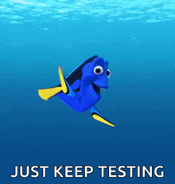

# ✅ Software-Testing

The course is designed to learn the basics of software testing. The basics of testing, integration and system testing, static testing and security testing of software products are considered.

