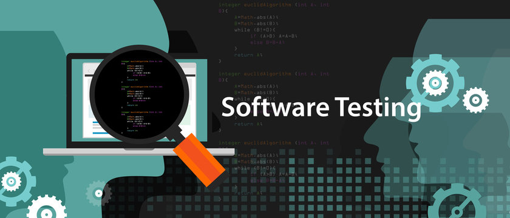

# 🧪 Software Testing

  

The course is designed to learn the basics of software testing. The basics of testing, integration and system testing, static testing and security testing of software products are considered.

### [1️⃣ Module Testing](lab1)
### [2️⃣ Integration Testing](lab2)
### [3️⃣ Functional Testing](lab3)