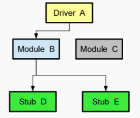
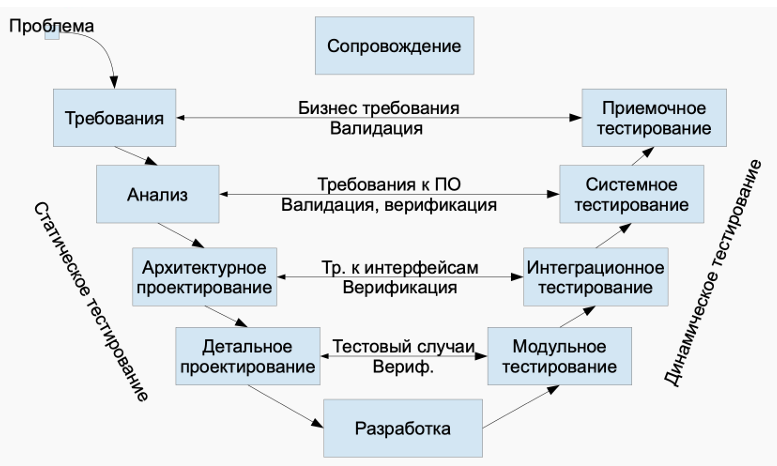
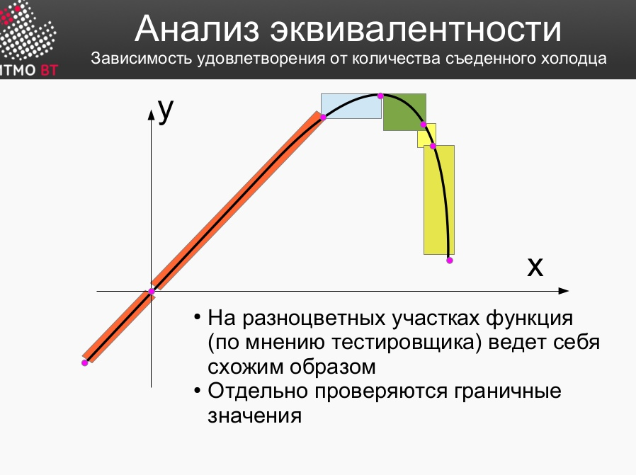
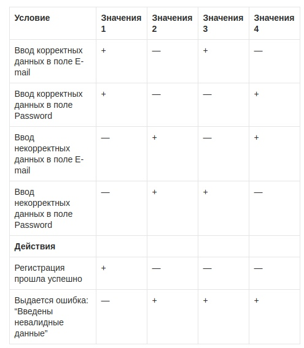
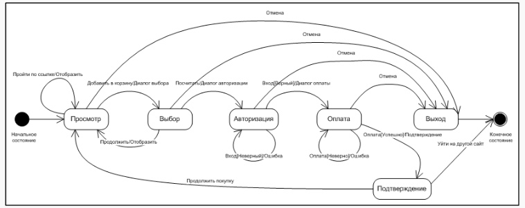

# Вопросы к защите лабораторной работы

## 1. Понятие тестирования ПО. Основные определения.

**ТПО** - это процесс для исследования и проверки соответствия между реальным поведением программы и ее ожидаемым поведением на конечном наборе тестов.

**Основные определеня**
- отладка
- требование к системе
т- естовый случай/сценарий
    - входные значения
    - предусловия, условия, постусловия
    - ожидаемый результат
- цель тестирования

## 2. Цели тестирования. Классификация тестов.

**Цели тестирования**

* Нахождение и исправление дефектов
* Повышение уверенности в уровне качества и доверия пользователя в работу программы

**Классификация тестов**

- По целям
    - Функциональное : какие и насколько верно функции ПО реализованы
    - Нефункциональное: как ПО работает:
        - Тестирование производительности
        - Тестирование пользовательского интерфейса (UI)
        - Тестирование удобства использования (UX)
        - Тестирование защищенности
        - Тестирование надежности
        - Тестирование установки
        - Тестирование совместимости
- По степени автоматизации
    - Ручное
    - Автоматизированное
- По позитивности сценария
    - Позитивное (на соответствие ожидаемому поведению)
    - Негативное (в случае отличия от ожидаемого)
- По доступу к коду
    - Тестирование «белого ящика» – тестирование ПО с доступом к коду.
    - Тестирование «черного ящика» – тестирование ПО без доступа к коду.
    - Тестирование «серого ящика» – тестирование, основанное на ограниченном знании внутренней структуры ПО.
- По уровню
    - Модульное / юнит-тестирование – проверка корректной работы отдельных единиц ПО.
    - Интеграционное тестирование – проверка взаимодействия между несколькими единицами ПО.
    - Системное – проверка работы всей системы
    - Приемочное тестирование
- По исполнителю
    - Альфа-тестирование: в команде или компании разработки ПО
    - Бета-тестирование: дать пользователю попробовать до официального запуска

## 3. Модульное тестирование. Понятие модуля.

**Модульное тестирование** - это процесс для проверки модули исходного кода программы

Цель модульного тестирования — изолировать отдельные части программы и показать их работоспособность.

**Модуль программы** - это компонент, который необходимо протестировать отдельно от остального
программного продукта. Для проведения модульного тестирования, модуль необходимо изолировать из системы.

**Изолирование модулей**

- Драйвер (Driver) - компонент, который вызывает и тестирует модули. Он должен последовательно вызывать тестируемый модуль с различными входными параметрами и условиями.
- Заглушка (Stub) - работает как подчиненная модуль, имеет тот же интерфейс с очень простой. При вызове заглушка возвращает определенное заранее значение.

## 4. V-образная модель. Статическое и динамическое тестирование.

**V-образная модель**

**Статическое тестирование** 

– Не включает выполнения кода
– Ручное, автоматизированное
– Неформальное, сквозной контроль, инспекция

**Динамическое**

– Запуск модулей, групп модулей, всей системы
– После появления первого кода (а иногда перед!)

## 5. Валидация и верификация. Тестирование методом "чёрного" и "белого" ящика.

**Валидация** – Проверка на соответствие ожиданиями пользователя

**Верификация** – Проверка на соответствие техническим требованиям и спецификации

**Тестирование методом белого ящика** - разработчик теста имеет доступ к исходному коду программ

**Тестирование методом чёрного ящика** - разработчик теста без доступа к исходному коду программ. Доступ к программе будет через интерфейсы или другой процесс, которые подключаться к системе для тестирования.

## 6. Тестовый случай, тестовый сценарий и тестовое покрытие.

* **Тестовый случай** — описание единичной проверки с заданными входными данными, условиями выполнения и ожидаемым и фактически результатам.
* **Тестовый сценарий** — описание набора проверок, который включает один или несколько тестовых случаев. У них общая цельь и функциональность, 
* **Тестовое покрытие** — метрика оценки качества тестирования. Он представляет себя как плотность покрытия тестами исполняемого кода.

## 7. Анализ эквивалентности.

При анализе эквивалентности модуль или функция разбивается на участки, где программа имеет класс эквивалентности

Класс эквивалентности - одно или несколько значений ввода, к которым ПО применяет одинаковую логику.

Для каждого участка нужен свой набор теста и для граничных значений участков нужны отдельные тесты.

Тогда можно сократить количество тестовых случаев.

## 8. Таблицы решений и таблицы переходов.

**Таблицы решений** показывает, как входные значения и условия влияют на выходные действия

**Таблицы переходов** – метод тестирования «черного ящика», который используется там, где аспект системы может быть описан конечным автоматом.

## 9. Регрессионное тестирование.

**Регрессионное тестирование** — это повторное тестирование уже проверенных частей программы после изменений, чтобы найти новые или повторно появившиеся ошибки.

Основные направления:

- Автоматизация регрессионных тестов

- Проверка исправленных багов (не вернулась ли ошибка)

- Поиск ошибок, которые появились из-за новых изменений (**Регрессионная ошибка**)

Основные задачи:

- Подтвердить исправление дефектов

- Проверить, что изменения не сломали другую функциональность

- Сократить время и стоимость тестирования за счёт автоматизации

## 10. Библиотека JUnit5. Особенности API. Класс `junit.framework.`.

**JUnit 5** — современный фреймворк модульного тестирования для Java, состоящий из трёх частей:

* **JUnit Platform** — запуск тестов;
* **JUnit Jupiter** — новый API для написания тестов;
* **JUnit Vintage** — поддержка старых тестов JUnit 3/4.

### Особенности API JUnit 5 (Jupiter):

* Аннотации: `@Test`, `@BeforeEach`, `@AfterEach`, `@BeforeAll`, `@AfterAll`, `@Disabled`, `@DisplayName`
* Поддержка параметризованных тестов (`@ParameterizedTest`)
* Улучшенные Assertions (`Assertions.*`)
* Поддержка лямбд и исключений (`assertThrows`)
* Расширяемость через `@ExtendWith`

### Класс `junit.framework`

Пакет `junit.framework` относится к **JUnit 3** и содержит базовые классы:

* `TestCase` — родительский класс для тестов
* `TestSuite` — набор тестов
* `Assert` — методы проверок

В JUnit 5 этот пакет **не используется**, так как новая версия основана на аннотациях и не требует наследования от `TestCase`.

