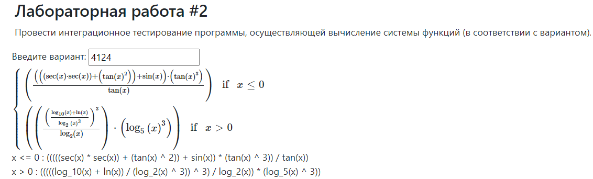
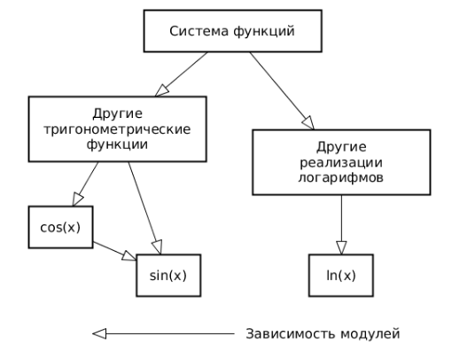

# Лабораторная работа 2

Провести интеграционное тестирование программы, осуществляющей вычисление системы функций (в соответствии с вариантом).

## Вариант: **4124**

> x <= 0 : (((((sec(x) * sec(x)) + (tan(x) ^ 2)) + sin(x)) * (tan(x) ^ 3)) / tan(x))

> x > 0 : (((((log_10(x) + ln(x)) / (log_2(x) ^ 3)) ^ 3) / log_2(x)) * (log_5(x) ^ 3))

  

## Правила выполнения работы

1. Все составляющие систему функции (как тригонометрические, так и логарифмические) должны быть выражены через базовые (тригонометрическая зависит от варианта; логарифмическая - натуральный логарифм).

2. Структура приложения, тестируемого в рамках лабораторной работы, должна выглядеть следующим образом (пример приведён для базовой тригонометрической функции sin(x)):

  

3. Обе "базовые" функции (в примере выше - sin(x) и ln(x)) должны быть реализованы при помощи разложения в ряд с задаваемой погрешностью. Использовать тригонометрические / логарифмические преобразования для упрощения функций ЗАПРЕЩЕНО.

4. Для КАЖДОГО модуля должны быть реализованы табличные заглушки. При этом, необходимо найти область допустимых значений функций, и, при необходимости, определить взаимозависимые точки в модулях.

5. Разработанное приложение должно позволять выводить значения, выдаваемое любым модулем системы, в сsv файл вида «X, Результаты модуля (X)», позволяющее произвольно менять шаг наращивания Х. Разделитель в файле csv можно использовать произвольный.

## Порядок выполнения работы

1. Разработать приложение, руководствуясь приведёнными выше правилами.

2. С помощью JUNIT5 разработать тестовое покрытие системы функций, проведя анализ эквивалентности и учитывая особенности системы функций. Для анализа особенностей системы функций и составляющих ее частей можно использовать сайт https://www.wolframalpha.com/.

3. Собрать приложение, состоящее из заглушек. Провести интеграцию приложения по 1 модулю, с обоснованием стратегии интеграции, проведением интеграционных тестов и контролем тестового покрытия системы функций.

[КОД РАЗРАБОТКИ ПРИЛОЖЕНИЯ](lab2/src/main/java)
[КОД ТЕСТИРОВАНИЯ](lab2/src/test/java)

## Отчёт по работе должен содержать

1. Текст задания, систему функций.
2. UML-диаграмму классов разработанного приложения.
3. Описание тестового покрытия с обоснованием его выбора.
4. Графики, построенные csv-выгрузкам, полученным в процессе интеграции приложения.
5. Выводы по работе.

[ВЫХОДНЫЕ ФАЙЛЫ CSV/ГРАФИКИ](lab2/output/)
[ОТЧЕТЫ SUREFIRE/JACOCO](lab2/target/site)

## Вопросы к защите лабораторной работы

1. Цели и задачи интеграционного тестирования. Расположение фазы интеграционного тестирования в последовательности тестов; предшествующие и последующие виды тестирования ПО.
2. Алгоритм интеграционного тестирования.
3. Концепции и подходы, используемые при реализации интеграционного тестирования.
4. Программные продукты, используемые для реализации интеграционного тестирования. Использование JUnit для интеграционных тестов.
5. Автоматизация интеграционных тестов. ПО, используемое для автоматизации интеграционного тестирования.

[QA](docs/QA.md)

*Создай отчеты SureFire и Jacoco с помощью CLI:* `mvn clean verify site`