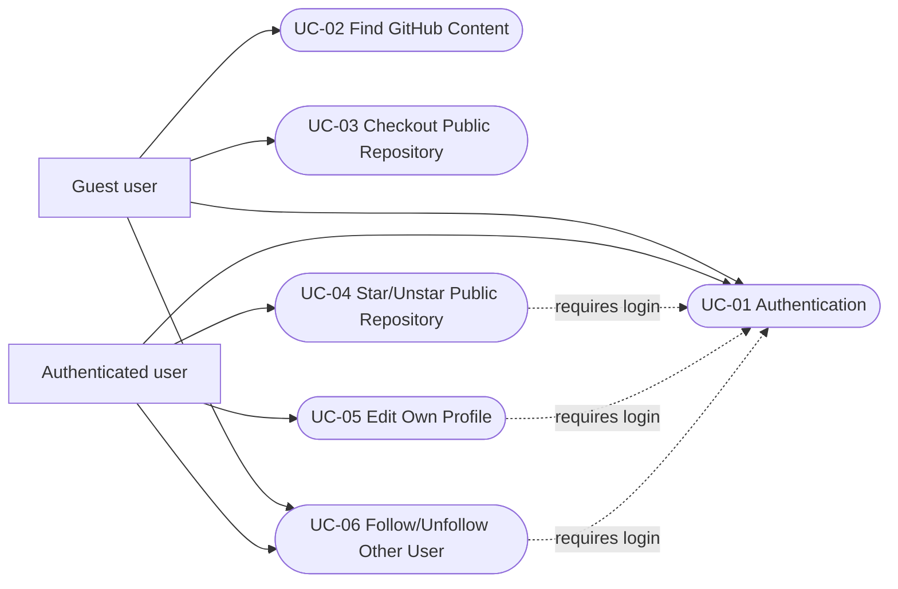

# Use Cases Cho Kiểm Thử GitHub

## 1. Thông Tin Chung

**Website được kiểm thử:** GitHub  
**URL:** `https://github.com`  
**Mục tiêu:** xây dựng test coverage dựa trên các mục tiêu sử dụng chính của người dùng, thay vì tách quá nhỏ theo từng thao tác đơn lẻ.

Cách chia mới:
- `Use case` = mục tiêu người dùng.
- `Scenario` = một nhánh kiểm thử cụ thể của use case.
- `Test method` = hiện thực kỹ thuật của scenario trong JUnit/Selenium.

---

## 2. Actor

| Actor | Mô tả |
| --- | --- |
| Guest user | Người dùng chưa đăng nhập, có thể mở trang chủ, search, xem repository và profile public |
| Authenticated user | Người dùng đã đăng nhập, có thể sign out, star repository, edit profile, follow/unfollow user |

---

## 3. Use Case Diagram

---

## 4. Danh Sách Use Case

| ID | Use case | Actor | Test file |
| --- | --- | --- | --- |
| UC-01 | Authentication | Guest/Auth user | `AuthenticationTest.java` |
| UC-02 | Search GitHub content | Guest user | `SearchTest.java` |
| UC-03 | Browse public repository | Guest user | `RepositoryTest.java` |
| UC-04 | Manage repository preference | Authenticated user | `RepositoryTest.java` |
| UC-05 | Manage own profile | Authenticated user | `ProfileTest.java` |
| UC-06 | Interact with other user | Guest/Auth user | `UserFollowTest.java` |

---

## 5. Use Case Chi Tiết

## UC-01. Authentication

**Actor:** Guest user / Authenticated user  
**Mục tiêu:** truy cập login page, xác thực, và kết thúc session bằng sign out.

**Scenario chính:**
1. Mở GitHub landing page.
2. Điều hướng sang login page.
3. Thử login sai để kiểm tra validation.
4. Login bằng credential hợp lệ.
5. Kiểm tra trạng thái signed-in.
6. Sign out.
7. Kiểm tra trạng thái signed-out.

**Kết quả mong đợi:** luồng xác thực và kết thúc phiên hoạt động đúng.

**Lưu ý:** Có thể bị ảnh hưởng bởi 2FA, captcha hoặc device verification.

---

## UC-02. Find GitHub Content

**Actor:** Guest user  
**Mục tiêu:** tìm kiếm nội dung trên GitHub và mở kết quả phù hợp.

**Scenario chính:**
1. Mở landing page.
2. Nhập keyword từ cấu hình test.
3. Submit search.
4. Kiểm tra URL chứa query.
5. Mở kết quả đầu tiên.

**Kết quả mong đợi:** tìm kiếm trả về kết quả và điều hướng sang trang mục tiêu.

---

## UC-03. Checkout Public Repository

**Actor:** Guest user  
**Mục tiêu:** truy cập repository public và điều hướng qua các tab chính.

**Scenario chính:**
1. Mở repository theo owner/repo trong `.env`.
2. Kiểm tra URL và tên repository.
3. Mở tab **Issues**.
4. Mở tab **Pull requests**.

**Kết quả mong đợi:** repository public và các tab chính hiển thị đúng.

---

## UC-04. Star/Unstar Public Repository

**Actor:** Authenticated user  
**Mục tiêu:** thay đổi trạng thái quan tâm với repository bằng star/unstar.

**Scenario chính:**
1. Mở repository public.
2. Click **Star** khi chưa login để được yêu cầu đăng nhập.
3. Login bằng credential hợp lệ.
4. Quay lại repository sau login.
5. Star repository.
6. Kiểm tra trạng thái **Starred**.
7. Unstar repository để cleanup.
8. Kiểm tra trạng thái trở lại **Star**.

**Kết quả mong đợi:** trạng thái star được cập nhật đúng và được khôi phục sau test.

---

## UC-05. Edit Own Profile

**Actor:** Authenticated user  
**Mục tiêu:** truy cập profile cá nhân và chỉnh sửa bio.

**Scenario chính:**
1. Login bằng credential hợp lệ.
2. Mở profile cá nhân từ user menu.
3. Kiểm tra nút **Edit profile**.
4. Lưu bio hiện tại.
5. Cập nhật bio mới.
6. Kiểm tra bio được cập nhật.
7. Khôi phục bio cũ.

**Kết quả mong đợi:** profile cá nhân mở đúng, bio được sửa và restore thành công.

---

## UC-06. Follow/Unfollow Other User

**Actor:** Guest user / Authenticated user  
**Mục tiêu:** xem profile người khác và thực hiện follow/unfollow.

**Scenario chính:**
1. Mở profile public theo username cấu hình.
2. Kiểm tra URL và profile name.
3. Click **Follow** khi chưa login để đến login page.
4. Login bằng credential hợp lệ.
5. Quay lại target profile.
6. Follow user.
7. Kiểm tra trạng thái **Unfollow**.
8. Unfollow user để cleanup.

**Kết quả mong đợi:** profile public hiển thị đúng, follow/unfollow hoạt động đúng.
